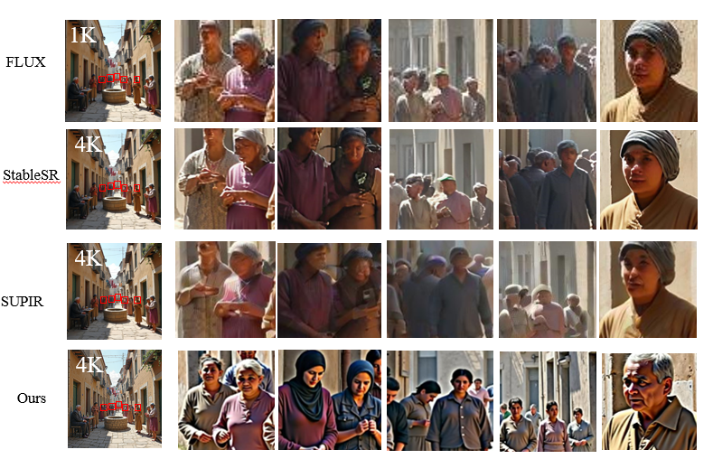

<div align="center">

<p align="center">
  
</p>

<h1>Restoring Semantic Fidelity for Training-Free High-Resolution Image Generation in Diffusion Transformers</h1>


## Comparing with SR method, [StableSR](https://github.com/IceClear/StableSR), [SUPIR](https://github.com/Fanghua-Yu/SUPIR)


## Comparing with training-based method, [HunyuanImage](https://github.com/Tencent-Hunyuan/HunyuanImage-2.1), [Sana1.5](https://github.com/NVlabs/Sana)


## 🔧 Installations
### Setup repository and conda environment

```bash
git clone https://github.com/ljjcoder/Restoring-Semantic-Fidelity.git
cd RSF

conda create -n RSF python=3.10
conda activate RSF

pip install -r requirements.txt
```


## 🎈 Quick Start
### Perform high-resolution image generation with Flux.1.0-dev
```bash
sh test.sh
```
Model downloading is automatic.


## 📎 Citation 

If you find our work helpful, please consider giving a star ⭐ and citation 📝 
```bibtex
@article{bu2025hiflow,
  title={HiFlow: Training-free High-Resolution Image Generation with Flow-Aligned Guidance},
  author={Bu, Jiazi and Ling, Pengyang and Zhou, Yujie and Zhang, Pan and Wu, Tong and Dong, Xiaoyi and Zang, Yuhang and Cao, Yuhang and Lin, Dahua and Wang, Jiaqi},
  journal={arXiv preprint arXiv:2504.06232},
  year={2025}
}
```


## 💞 Acknowledgements
The code is built upon the below repositories, we thank all the contributors for open-sourcing.
* [Flux](https://github.com/black-forest-labs/flux)
* [Hiflow](https://github.com/Bujiazi/HiFlow.git)

